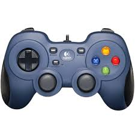
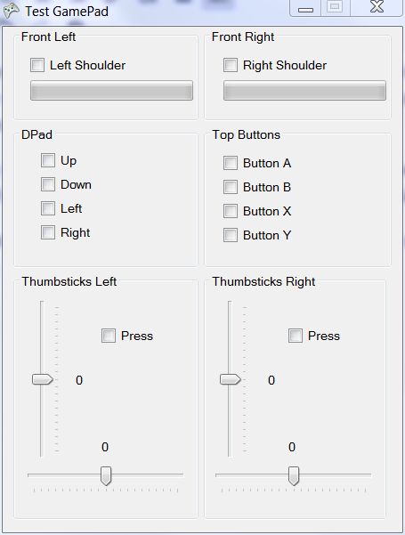

# Utilisation d'une manette de jeu avec Visual Studio en C# #
Réalisation d'une application de test des principaux contrôles possibles avec une manette compatible Logitech.

[Tutoriel complet](http://silanus.fr/sin/?p=749 "http://silanus.fr/sin/?p=749")

Basé sur l'utilisation du framework Microsoft Xna 4.0 :

Téléchargez et installez [XNA Game Studio 4.0 :](https://www.microsoft.com/en-us/download/details.aspx?id=23714 "https://www.microsoft.com/en-us/download/details.aspx?id=23714") 

